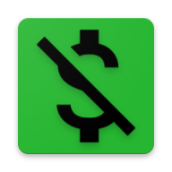

    

<h1 align="center">Spending Awareness</h1>

A Flutter app to make better awareness of how you spend your money

    

    

        <a href="#app_in_google_play">App in Google Play</a>
        <a href="#objective">Objective</a> | 
        <a href="#technology">Technology</a> | 
        <a href="#packages">Packages</a> | 
        <a href="#license">License</a> | 
        <a href="#author">Author</a>
   

   

   

       <h2>App in Google Play</h2>
       
You can download it 
            <a href="https://play.google.com/store/apps/details?id=com.rodrigorivas.spending_awareness">
            here
            </a>
        

   

   

        <h2>Objective</h2>
        
Learn how to upload an app to Google Play, start improving my knowledge of Flutter animations, and initiate in internationalization.

    

   

        <h2>Technology</h2>
        
Flutter at 1.25.0-8-3.pre - channel beta with Dart 2.12.0

   

   

        <h2>Packages</h2>
        <a href="https://pub.dev/packages/flutter_modular">flutter_modular</a> 
        <a href="https://pub.dev/packages/flutter_mobx">flutter_mobx</a> 
        <a href="https://pub.dev/packages/mobx">mobx</a> 
        <a href="https://pub.dev/packages/flutter_intro">flutter_intro</a> 
        <a href="https://pub.dev/packages/flutter_masked_text">flutter_masked_text</a> 
        <a href="https://pub.dev/packages/path_provider">path_provider</a> 
        <a href="https://pub.dev/packages/hive">hive</a> 
        <a href="https://pub.dev/packages/asuka">asuka</a> 
    

Running at Flutter 1.25.0-8-3.pre - channel beta
Dart 2.12.0 (build 2.12.0-0-133.7.beta)
